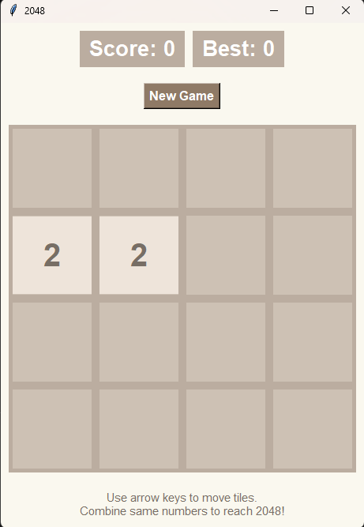
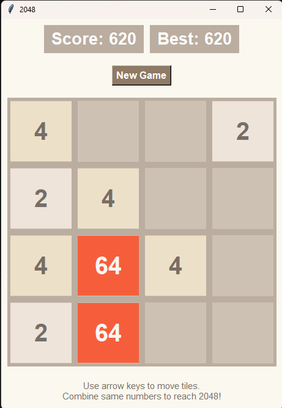

# 2048 Game

A Python-based implementation of the popular game **2048**, built using the Tkinter library for the graphical user interface. The objective of the game is to combine tiles with the same number to reach the tile with the number 2048.

## Why I Made This
The 2048 game has always been a personal favorite of mine. I wanted to recreate it from scratch to test and enhance my logical coding skills. Additionally, I aimed to develop it into a full-fledged app, starting with this Python-based version.

## Features
- Intuitive graphical interface built with Tkinter.
- Score and high score tracking.
- Keyboard controls (Arrow keys or WASD) for smooth gameplay.
- Dynamic game over prompt with score details and replay option.
- Responsive design with colored tiles for different numbers.

## Installation

### Prerequisites
Ensure you have Python 3.x installed on your system. You can download it from [python.org](https://www.python.org/).

### Steps
1. Clone the repository or download the `2048.py` file.
   ```bash
   git clone <repository_url>
   cd <repository_folder>
   ```

2. Install the required Python library `numpy` if not already installed:
   ```bash
   pip install numpy
   ```

3. Run the script:
   ```bash
   python 2048.py
   ```

## How to Play
1. Start the game by running the script.
2. Use the arrow keys or WASD to move the tiles in the desired direction.
3. Combine tiles with the same number to create a tile with their sum.
4. Try to achieve a tile with the number **2048**.

### Controls
- **Arrow Keys**: Move tiles up, down, left, or right.
- **WASD Keys**: Alternative controls for moving tiles.

## Files Included
- **`2048.py`**: The main game script.

## Code Highlights
- **Grid Initialization**: The 4x4 grid is initialized with two random tiles at the start of the game.
- **Dynamic Tile Updates**: Colors and numbers are updated dynamically based on the tile values.
- **Game Logic**: Movement, combination of tiles, and game-over detection implemented using core algorithms.

## Screenshots




## Contributing
Contributions are welcome! If you have suggestions or improvements:
1. Fork the repository.
2. Create a new branch.
3. Submit a pull request with a detailed description of the changes.

## License
This project is licensed under the MIT License - see the [LICENSE](LICENSE) file for details.

## Acknowledgements
- Inspired by the original **2048** game created by Gabriele Cirulli.
- Thanks to the Python and Tkinter community for their excellent tools and resources.
